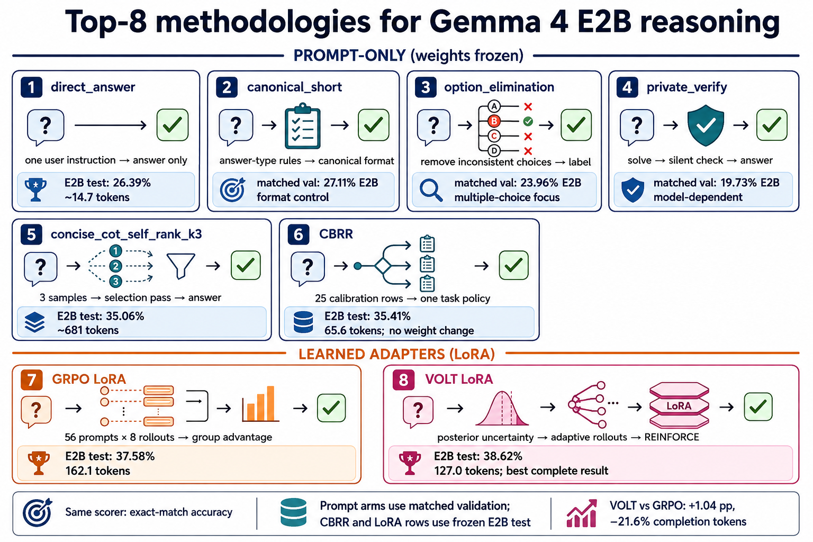

# Gemma 4 E2B/E4B Reasoning Evaluation

An auditable harness for exact-match reasoning evaluation on:

- **BBH** — `suzgunmirac/BIG-Bench-Hard`
- **BBEH** — `google-deepmind/bbeh`
- **USR** — `google-deepmind/unpuzzles_and_simple_reasoning`

The API evaluator sends exactly one `user` message and no system message. The
repository contains 29 prompt arms; the learned RL/LoRA implementation is on
the [`rl-volt` branch](https://github.com/CatfishW/gemma4-bbh-bbeh-eval/tree/rl-volt).

## Headline results

The strongest complete frozen-test result is **VOLT LoRA: 38.62%** on E2B
(3,688/9,550), using 127.0 mean completion tokens. VOLT is +1.04 percentage
points over the compute-matched GRPO adapter and uses 21.6% fewer completion
tokens.

### Prompt-only API track

| Method | E2B frozen test | Mean completion tokens | Weight change |
|---|---:|---:|---|
| `direct_answer` | 2,520/9,550 (**26.39%**) | 14.68 | None |
| `concise_cot_self_rank_k3` | 3,348/9,550 (**35.06%**) | 681.26 | None |
| **CBRR** | **3,382/9,550 (35.41%)** | **65.60** | None |

CBRR beats direct answering by 9.03 points (1,100 paired wins vs 238 losses;
McNemar `p = 1.33e-132`). It is a separate prompt-routing track, not a direct
replacement for the local LoRA evaluation.

### Learned local adapter track

| Model | `concise_cot` E2B test | Mean completion tokens | Direct-answer transfer |
|---|---:|---:|---:|
| Base E2B | 1,823/9,550 (**19.09%**) | 222.1 | 26.00% |
| GRPO LoRA | 3,589/9,550 (**37.58%**) | 162.1 | 29.54% |
| **VOLT LoRA** | **3,688/9,550 (38.62%)** | **127.0** | **30.58%** |

On paired `concise_cot` predictions, VOLT has 678 wins and 579 losses over
GRPO (`p = 0.005686`). The gain comes mainly from BBEH and USR; GRPO is
slightly better on BBH.

## Methodology figures



- [Prompt-only methodology flows](figures/prompt_only_methodologies.png)
- [GRPO vs VOLT LoRA training and evaluation](figures/rl_lora_comparison.png)
- [Detailed VOLT loop](figures/volt_methodology_figure.png)
- [Full methodology guide](docs/top_methodologies.md)
- [Visual/code audit](docs/top_methodologies_visual_audit.md)

## Evaluation protocol

- **Data:** 12,540 examples — BBH 6,511, BBEH 4,520, USR 1,509 — across 60 tasks.
- **Within-task split:** calibration indices 0–24, validation 25–49, untouched
  test indices ≥50. The frozen E2B test has 9,550 examples (5,161 BBH,
  3,370 BBEH, 1,019 USR).
- **RL split:** every fourth task per benchmark is held out (16 tasks); 1,040
  usable calibration prompts remain after dropping 60 prompts over the
  3,072-token training prompt cap.
- **Scoring:** normalize/extract the answer, then apply the unchanged
  benchmark exact-match scorer. No human preference model is used.
- **Prompt requests:** one `user` message, no system message. Prompt arms keep
  model weights frozen.

Primary artifacts: [`docs/E2B_CONFIRMATORY_PROTOCOL.md`](docs/E2B_CONFIRMATORY_PROTOCOL.md),
[`experiments/e2b_arm_manifest.jsonl`](experiments/e2b_arm_manifest.jsonl),
and the [E2B confirmatory result bundle](results/e2b-confirmatory-20260709_231405).

## Top methodologies (N = 8)

These are the eight representative methods that cover the best measured arms,
the main prompt mechanisms, and both learned RL tracks. The full 29-arm matrix
is in the [RL-branch detailed results](https://github.com/CatfishW/gemma4-bbh-bbeh-eval/blob/rl-volt/docs/DETAILED_RESULTS.md)
and [`docs/PROMPT_OPTIMIZATION_RESEARCH.md`](docs/PROMPT_OPTIMIZATION_RESEARCH.md).

### 1. `direct_answer` — the control

**Implementation:** append “Return only the final answer. Do not include
reasoning, explanation, or extra text,” make one generation call, and parse the
answer.

**Purpose:** lowest latency and a clean reference for every improvement claim.
It is cheap, but supplies no reasoning or verification scaffold.

### 2. `canonical_short` — output-format control

**Implementation:** instruct the model to emit the canonical type requested by
the task: one option label, exactly `Yes`/`No`, digits for numbers, or the list
alone.

**Purpose:** reduces exact-match failures caused by wrappers, prose, or label
formatting. It changes the surface form, not model weights.

### 3. `option_elimination` — private choice search

**Implementation:** eliminate choices that contradict the question, then output
the remaining option label.

**Purpose:** targets multiple-choice distractors and common logical traps; it is
less useful on free-form tasks.

### 4. `private_verify` — bounded silent checking

**Implementation:** solve once, perform one private check, and return only the
answer. The check is deliberately short rather than a visible long chain of
thought.

**Purpose:** can catch arithmetic, negation, and constraint errors, but is
model-dependent. It helped E4B more than E2B and can trigger unnecessary
self-revision on a smaller model.

### 5. `concise_cot_self_rank_k3` — sample, then select

**Implementation:** sample three concise reasoning attempts at temperature 0.7,
normalize their candidate answers, then use a fourth selection pass to choose
and print the best answer.

**Purpose:** the selection pass acts as both a verifier and a formatting repair
step. It is the best universal prompt arm, but costs roughly 681 completion
tokens per example.

### 6. CBRR — conservative Bayesian task routing

**Implementation:**

1. Evaluate candidate prompt arms on the first 25 calibration examples of each
   task.
2. Count paired wins/losses against `direct_answer`.
3. Fit a Beta-Bernoulli posterior and require conservative net-win/posterior
   thresholds.
4. Freeze one selected arm per task for the remaining examples; fall back to
   `direct_answer` when evidence is insufficient.

CBRR performs one routed model call at deployment and never changes weights or
selects a new arm per example.

### 7. GRPO LoRA — compute-matched RL baseline

**Implementation:** the [`rl-volt` branch](https://github.com/CatfishW/gemma4-bbh-bbeh-eval/tree/rl-volt)
adds a rank-32, alpha-64 LoRA adapter to Gemma 4 E2B. Each of 48 iterations
selects 56 prompts and generates eight fixed rollouts per prompt (448 total).
Binary exact-match rewards are normalized by the group mean and standard
deviation:

```text
A = (r - group_mean) / (group_std + 1e-4)
```

All-correct and all-wrong groups have zero standard deviation and therefore zero
relative advantage. In the recorded run, 5,432 of 21,504 rollouts had nonzero
advantage.

### 8. VOLT LoRA — variance-aware adaptive rollout RL

VOLT uses the same base model, data split, reward, and LoRA parameterization as
GRPO, but changes how evidence is allocated and centered.

1. **Posterior snapshot:** maintain discounted hierarchical Beta statistics
   (discount 0.92, prior strength 4.0) for each prompt and task.
2. **Baseline:** use `b_i = E[p_i]` as a frozen success baseline.
3. **Uncertainty:** use `s_i = sqrt(E[p_i(1-p_i)])` as the allocation score.
4. **Adaptive budget:** reserve a 15% least-recently-sampled exploration floor,
   water-fill the remaining budget by `s_i`, and cap each prompt at 1–8
   rollouts.
5. **Reward and advantage:** score each fresh completion with binary exact
   match and use `A_i = r_i - b_i`.
6. **Update:** broadcast the sequence-level advantage over completion tokens and
   apply on-policy REINFORCE with a constant length normalizer of 384. AdamW
   updates only the LoRA parameters.
7. **History update:** after the optimizer step, discount old statistics and
   add the new outcomes before the next iteration.

Optional success-conditioned length shaping exists in the implementation but is
disabled for the reported run. At inference, VOLT is an ordinary adapter: one
user message, greedy decoding, and no posterior, allocator, or reward function.

Implementation references: [`rl/posterior.py`](https://github.com/CatfishW/gemma4-bbh-bbeh-eval/blob/rl-volt/rl/posterior.py),
[`rl/trainer.py`](https://github.com/CatfishW/gemma4-bbh-bbeh-eval/blob/rl-volt/rl/trainer.py),
[`rl/rewards.py`](https://github.com/CatfishW/gemma4-bbh-bbeh-eval/blob/rl-volt/rl/rewards.py),
and [`rl/eval_policy.py`](https://github.com/CatfishW/gemma4-bbh-bbeh-eval/blob/rl-volt/rl/eval_policy.py).

## Results by split and evaluation track

These tables intentionally separate validation selection from final frozen-test
evaluation. The prompt-only rows use the API serving stack; the RL rows use the
local BF16 Gemma 4 checkpoint, so cross-track comparisons are directional.

### Prompt-arm validation (matched split)

The validation split contains 675 BBH, 575 BBEH, and 240 USR examples. These
results were used to select prompt strategies; they are not the frozen test.
E4B is exploratory because it informed strategy development.

| Prompt arm | BBH | BBEH | USR | Overall | E4B overall |
|---|---:|---:|---:|---:|---:|
| `concise_cot_self_rank_k3` | **59.11%** | 11.30% | **17.50%** | **33.96%** | **39.13%** |
| `canonical_short` | 45.33% | **11.48%** | 13.33% | 27.11% | 33.56% |
| `direct_answer` | 40.74% | 10.43% | 15.83% | 25.03% | 32.55% |
| `option_elimination` | 41.63% | 9.22% | 9.58% | 23.96% | 31.34% |
| `private_verify` | 29.93% | 10.61% | 12.92% | 19.73% | 34.23% |

### Frozen test: prompt-only API track

All rows below use the same 9,550-example E2B frozen test (5,161 BBH,
3,370 BBEH, 1,019 USR).

| Method | BBH | BBEH | USR | Overall | Calls/example | Mean tokens |
|---|---:|---:|---:|---:|---:|---:|
| `direct_answer` | 40.73% | **10.80%** | 5.30% | 26.39% | 1 | 14.68 |
| `concise_cot_self_rank_k3` | **57.31%** | 10.30% | 4.22% | 35.06% | 4 | 681.26 |
| **CBRR** | **57.33%** | 10.68% | **6.18%** | **35.41%** | routed | **65.60** |

### Frozen test: learned local adapter track

RL trains with one fixed `concise_cot` prompt and evaluates with one greedy
generation. These values are directly comparable to one another.

| Model | BBH | BBEH | USR | Overall | Mean tokens |
|---|---:|---:|---:|---:|---:|
| Base E2B | 33.66% | 2.17% | 1.28% | 19.09% | 222.1 |
| GRPO LoRA | **62.60%** | 8.84% | 5.89% | 37.58% | 162.1 |
| **VOLT LoRA** | 61.91% | **11.78%** | **9.42%** | **38.62%** | **127.0** |

On the same frozen test, VOLT's 9.42% USR accuracy is above CBRR (6.18%) and
self-rank (4.22%). The larger 17.50% and 15.83% USR figures above are matched
validation results, not the frozen-test scores. The direct-answer transfer
check is Base 26.00%, GRPO 29.54%, and VOLT 30.58%.

## Access

The public OpenAI-compatible endpoint is `https://llm.agaii.org/llm/v1`:

```bash
curl https://llm.agaii.org/llm/v1/models
```

Use `SubTokenLLM-E2B` for E2B and `SubTokenLLM` for E4B. Serving, routing, and
systemd setup are documented in [`ops/`](ops/) and the deployment snapshot
([`paper/e2b-e4b-study/deployment-verification-20260710.md`](paper/e2b-e4b-study/deployment-verification-20260710.md)).

## Reproduce

### Prompt evaluation

```bash
DATA_ROOT=/data/benwulab/gemma4-eval/datasets ./scripts/download_datasets.sh

python3 eval_benchmarks.py \
  --datasets-root /data/benwulab/gemma4-eval/datasets \
  --base-url http://127.0.0.1:8888/v1 \
  --model SubTokenLLM \
  --benchmarks bbh,bbeh,usr \
  --prompt-strategy direct_answer \
  --parallel 2 \
  --output-dir /data/benwulab/gemma4-eval/runs/example
```

Use `--prompt-strategy <name>` for any arm, `--self-consistency-k N` with
`--response-selection majority_vote|self_rank`, or `--prompt-policy policy.json`
for CBRR-style routing. See [`scripts/calibrate_prompt_policy.py`](scripts/calibrate_prompt_policy.py)
and [`docs/E2B_CONFIRMATORY_PROTOCOL.md`](docs/E2B_CONFIRMATORY_PROTOCOL.md).

### RL/LoRA evaluation

Switch to the RL branch first:

```bash
git fetch origin rl-volt
git switch --detach origin/rl-volt
python rl/run_train.py --config experiments/rl/grpo_e2b.json
python rl/run_train.py --config experiments/rl/volt_e2b.json
./scripts/run_rl_evals.sh
```

Training uses calibration rows only; validation probes select the checkpoint;
the frozen test is evaluated once for the selected adapter.

## Repository map

```text
eval_benchmarks.py       prompt construction, generation, parsing, scoring
rl/                      VOLT/GRPO LoRA training and local evaluation (rl-volt)
scripts/                 sweeps, CBRR calibration, analysis, collection
experiments/             frozen protocols, manifests, RL configs
docs/                    protocols, detailed results, methodology guide
paper/                   study manuscripts, theory, audits
results/                 archived summaries and prediction bundles
ops/                     model serving, router, tunnel, systemd helpers
tests/                   scorer, protocol, router, and RL-math tests
```

## Caveats

- Prompt-only API results and local LoRA results use different serving stacks;
  compare them as complementary tracks, not as a single controlled leaderboard.
- The 42.92% reward-routed-v1 result is an offline replay with partial live
  validation; the complete live v2 result is 36.41% on its 11,040-example set.
- VOLT's evidence is currently one benchmark mixture and one selected
  checkpoint family; it is not a claim of universal superiority.
