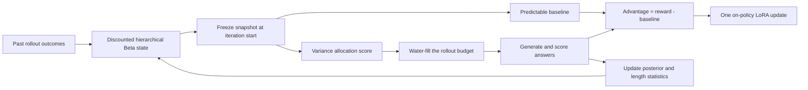

# Gemma 4 E2B/E4B Reasoning Evaluation

<p align="center">
  <a href="./README.md"></a>
  <a href="./README.zh-CN.md"></a>
</p>

This repository measures — and then improves — how well two small deployed
language models (Gemma 4 E2B and E4B) solve hard reasoning benchmarks, without
ever touching the benchmark's test questions during tuning.

It contains three things:

1. **An evaluation harness** (`eval_benchmarks.py`) that asks a model
   benchmark questions one at a time and scores the answers by exact match.
2. **A prompt-strategy study**: 26 different ways of phrasing the request
   ("prompt strategies"), measured head-to-head, plus a calibrated per-task
   router (CBRR) that picks the best strategy for each task. No model weights
   change.
3. **A reinforcement-learning method (VOLT)** that does change model weights:
   LoRA fine-tuning driven by a novel budget-aware RL algorithm, trained only
   on the small calibration split of the same protocol. Method and theory live
   in [paper/volt/](paper/volt/).

## The benchmarks

| Benchmark | What it tests | Examples used |
|---|---|---:|
| **BBH** (BIG-Bench Hard, 27 tasks) | Logic, dates, tables, tracking objects, word sorting | 6,511 |
| **BBEH** (BIG-Bench Extra Hard, 23 tasks) | Much harder successors of BBH tasks | 4,520 |
| **USR** (Unpuzzles & Simple Reasoning) | Puzzles, "unpuzzled" trivial variants, simple reasoning | 1,509 |

12,540 examples total. Every example has a known correct answer, so scoring is
automatic: the model's reply is normalized (case, punctuation, option-label
forms like `(A)` vs `A`, numbers, LaTeX) and compared with the reference.

**The split rule (frozen before any tuning):** inside every task, examples are
numbered. Numbers 0-24 are *calibration* (may be used for tuning), 25-49 are
*validation* (may be used for selecting between tuned variants), and 50+ are
the *test* split (9,550 examples) that nothing is ever tuned on. All headline
numbers below are from that untouched test split.

## The models

- `SubTokenLLM-E2B` — Gemma 4 E2B instruction-tuned ("effective 2B" parameters).
- `SubTokenLLM` — Gemma 4 E4B ("effective 4B").

Both are served behind an OpenAI-compatible API. Every request contains exactly
one `user` message and no system prompt, so results reflect the model, not
hidden instructions:

```python
from openai import OpenAI

client = OpenAI(base_url="https://llm.agaii.org/llm/v1", api_key="EMPTY")
response = client.chat.completions.create(
    model="SubTokenLLM-E2B",
    messages=[{"role": "user", "content": "Reply with exactly: online"}],
    max_completion_tokens=16,
    temperature=0,
)
```

## Headline results (E2B, frozen test split, 9,550 examples)

| Approach | Weights changed? | Accuracy | Avg tokens per answer |
|---|---|---:|---:|
| Ask for the answer directly (`direct_answer`) | No | 26.39% | 15 |
| Best universal prompt (`concise_cot_self_rank_k3`) | No | 35.06% | 681 |
| CBRR per-task prompt router | No | **35.41%** | 66 |
| VOLT RL fine-tuning (this branch) | Yes (LoRA) | *training in progress* | - |

How to read this: just asking better questions moves this small model from
26% to 35% — and the router gets the same accuracy as the best prompt while
generating one tenth as much text. The gain is statistically solid (McNemar
p ≈ 1e-132, bootstrap +8.4 to +9.6 points) and concentrated in BBH; BBEH
barely moves with any prompt. On the larger E4B model the router reaches
41.6% on the matched validation set.

All other tables (per-dataset breakdowns, both models, all 29 arms, robustness
checks) are in [docs/DETAILED_RESULTS.md](docs/DETAILED_RESULTS.md).

## The 26 prompt strategies, explained

A prompt strategy is a fixed instruction appended to the benchmark question
(the question always comes first, then the instruction). Percentages in
parentheses are overall accuracy on the matched validation split for
(E2B / E4B) — baseline `direct_answer` is (25.0% / 32.6%). The full per-dataset
matrix is in [docs/DETAILED_RESULTS.md](docs/DETAILED_RESULTS.md#3-all-29-universal-arms-by-model-and-dataset-matched-validation).

### Baselines

- **`raw`** — sends the dataset question with no instruction at all. The model
  tends to chat, explain, or hedge, which fails exact-match scoring. This is
  the floor (2.0% / 2.2%), and it is why every other strategy exists.
- **`direct_answer`** — "Return only the final answer. Do not include
  reasoning, explanation, or extra text." Cheap (about 15 tokens per answer)
  and surprisingly strong (25.0% / 32.6%). The reference point for everything
  else.

### Controlling the answer format

These change *how* the answer is written, not how the model thinks.

- **`canonical_short`** — spells out normalization rules: one option label for
  multiple choice, exactly `Yes`/`No` for booleans, digits for numbers, the
  list alone for lists. Best pure-formatting strategy (27.1% / 33.6%); it beat
  `direct_answer` on both models just by reducing format mismatches.
- **`native_format`** — "answer in exactly the format the question requests"
  (some items ask for `<answer>` tags or a fixed sentence). (22.8% / 31.5%)
- **`answer_type_router`** — first privately decide the answer *type* (label,
  boolean, number, phrase, list, tag), then output the most parseable form of
  that type. (22.0% / 28.1%)
- **`strict_json`** — answer as a JSON object `{"answer": ...}`. Brittle:
  wrappers get malformed or truncated, and scoring then fails even when the
  content is right (8.5% / 12.6%). A cautionary result for structured-output
  fans; the JSON failure modes are audited in
  [format_audit.md](paper/e2b-e4b-study/format-audit/format_audit.md).

### Think privately, answer only

These ask the model to reason or verify *silently* and print only the final
answer, keeping outputs short while (hopefully) improving the decision.

- **`careful_direct`** — "read carefully, including every condition and
  option label, then answer only." (19.7% / 31.7%)
- **`private_verify`** — solve, check once privately, then answer. Strongly
  model-dependent: it *hurt* E2B and *helped* E4B (19.7% / 34.2%), matching
  the literature finding that small models need external verifiers to
  self-correct reliably.
- **`selective_verify`** — keep the first answer unless a targeted check finds
  a concrete contradiction (missed negation, ignored constraint, arithmetic
  or label error). Designed to prevent needless self-revision. (22.6% / 31.5%)
- **`compare_then_commit`** — privately identify the two most plausible
  answers, compare both against the exact constraints, reject the weaker.
  Middling as a universal prompt (22.4% / 32.7%) but the single biggest
  contributor when *routed* to the tasks where it wins (+214 correct answers
  in the live routed run).
- **`fast_slow_gate`** — answer directly; only verify if genuinely uncertain.
  The gating language confused small models badly (8.5% / 19.1%).
- **`constraint_guard`** — extract the decisive constraints, derive a
  candidate, test it against each constraint once. (20.9% / 32.9%)
- **`negation_label_guard`** — pay special attention to NOT/EXCEPT/quantifiers
  and map content to the option label as a final step. (12.6% / 20.1%)
- **`draft_verify`** — very short private symbolic draft, then one check.
  (10.3% / 27.6%)
- **`option_elimination`** — for multiple choice, eliminate wrong options
  privately before deciding. (24.0% / 31.3%)
- **`condition_reconstruction`** — derive a candidate, hide the condition most
  able to falsify it, reconstruct that condition from the candidate, and
  compare with the actual text. (20.7% / 30.7%)
- **`counterexample_guard`** — try one targeted counterexample against the
  candidate before committing. (22.0% / 32.5%)
- **`rank_two_paths`** — build two genuinely different solution paths
  privately, rank them, use the stronger. (21.9% / 32.2%)

### Show brief reasoning, then a delimited answer

These allow visible reasoning but require a final line
`The final answer is: <answer>` that the scorer can extract.

- **`concise_cot`** — "think briefly," then the delimiter line. Excellent on
  BBH (35.4% / 46.7% there) but weak overall (17.4% / 24.3%) because on BBEH
  and USR the model often runs out of tokens or buries the answer.
- **`chain_of_draft`** — terse scratch notes instead of prose sentences, then
  the delimiter. Same profile, slightly better (17.7% / 28.7%).
- **`premise_conclusion`** — list the key premises, derive the conclusion.
  (16.5% / 23.8%)
- **`step_back`** — first state the general rule, then apply it. Small models
  spend the token budget philosophizing (4.1% / 8.9%).
- **`plan_and_solve`** — write a short plan, then solve. (4.1% / 6.0%)
- **`plan_and_solve_plus`** — detailed plan plus variable extraction plus
  verification. The longest template and the worst performer (1.3% / 2.1%):
  it reliably exhausts the token budget before answering.
- **`least_to_most`** — decompose into subproblems, solve simplest-to-hardest.
  (1.8% / 3.8%)
- **`symbolic_proof`** — translate to compact symbols or a proof sketch, then
  solve. (1.8% / 2.2%)

The pattern across this family: for small models under exact-match scoring,
verbose reasoning templates only pay off when a reliable extraction/selection
step follows. Which leads to:

### Sampling on top of a strategy (arms, not strategies)

Two inference-scaling variants wrap `concise_cot`:

- **Self-consistency (`concise_cot_sc_k3`)** — sample 3 answers at temperature
  0.7, take the majority-normalized answer. Barely helps (19.3% / 25.3%):
  majority voting cannot fix formatting failures.
- **Self-ranking (`concise_cot_self_rank_k3`)** — sample 3 answers, then ask
  the model to pick the best candidate and output only that answer. The best
  universal arm (34.0% / 39.1%): the selection pass both verifies and fixes
  formatting. Cost: about 681 tokens per answer.

## The CBRR prompt router (no weight changes)

Different tasks favor different strategies, so a single universal prompt
leaves accuracy on the table. CBRR ("conservative Bayesian reward router")
uses each task's 25 calibration examples to decide, per task, whether any
strategy beats `direct_answer` there — using a Beta-Bernoulli posterior on
paired wins/losses, switching only when the evidence is clear — and then
applies that one fixed strategy to every later example of the task. It never
selects per example.

Result on the frozen test split: 35.41% vs 26.39% for direct answering, at 66
tokens per answer (the best universal arm needs 681). Fit it yourself with
`scripts/calibrate_prompt_policy.py`; the evaluator accepts the resulting
policy file via `--prompt-policy`, and records the arm used for every
prediction. Protocol, amendments, and analysis:
[docs/E2B_CONFIRMATORY_PROTOCOL.md](docs/E2B_CONFIRMATORY_PROTOCOL.md),
[docs/PROMPT_OPTIMIZATION_RESEARCH.md](docs/PROMPT_OPTIMIZATION_RESEARCH.md).

## VOLT: variance-optimal reinforcement learning under a rollout budget

Prompt routing tops out near 35% because it never changes model weights. The
`rl/` package instead fine-tunes E2B through LoRA with **VOLT** — **V**ariance-
**O**ptimal a**L**location of **T**okens — an RL-with-verifiable-rewards (RLVR)
method designed for little training data, binary correctness rewards, one
shared GPU, and a fixed generation budget.

### Why fixed GRPO groups waste tokens

GRPO gives every selected prompt a fixed group of sampled solutions and
computes advantages from that group's reward mean and standard deviation. With
binary rewards, an eight-answer group that is all correct or all wrong has
zero advantage everywhere. Its generated tokens cannot update the policy.

That is common in this suite: many BBH prompts are nearly solved, while many
BBEH prompts are nearly impossible. Only prompts near the model's current
learning frontier reliably produce mixed groups.

| Property | GRPO | VOLT |
|---|---|---|
| Rollouts per selected prompt | Fixed at 8 | Adaptive, 1–8 |
| Advantage baseline | Current group mean | Frozen historical posterior mean |
| One-rollout update | Zero or undefined | Valid |
| All-correct/all-wrong samples | Zero advantage | Usually nonzero advantage |
| Uses historical difficulty | No | Yes, with task-level pooling |
| Exploration | Random prompt rotation | 15% least-recently-sampled floor |

### One posterior drives the method

For each training prompt `i`, VOLT tracks its current success probability
`p_i = P(correct | prompt_i)` with discounted Beta evidence. The prompt borrows
a prior mean from other examples in the same benchmark task:

```text
task_mean_i = (task_wins + 1) / (task_wins + task_losses + 2)
alpha_i     = discounted_prompt_wins   + m * task_mean_i
beta_i      = discounted_prompt_losses + m * (1 - task_mean_i)
```

The current configuration uses prior mass `m = 4` and discounts old evidence
by `gamma = 0.92` every iteration so the tracker follows a changing policy.
Before generating anything in iteration `k`, VOLT freezes a posterior snapshot.
That snapshot supplies two active quantities:

```text
baseline_i = E[p_i] = alpha_i / (alpha_i + beta_i)

score_i    = sqrt(E[p_i(1-p_i)])
           = sqrt(alpha_i * beta_i /
                  ((alpha_i + beta_i) * (alpha_i + beta_i + 1)))
```

The baseline estimates expected correctness. The score estimates where binary
reward variation—and therefore usable policy-gradient signal—is concentrated.
It is largest around `p = 0.5` and shrinks toward zero for almost-always-correct
or almost-always-wrong prompts.

### Variance-optimal rollout allocation

Suppose prompt `i` receives `n_i` rollouts, each costing about `l_i` tokens,
and its gradient estimator has variance `v_i`. Minimizing total estimator
variance under a generation budget gives the square-root allocation

```text
n_i ∝ sqrt(v_i / l_i).
```

VOLT models policy-score variance as growing roughly linearly with completion
length, `v_i ≈ kappa * p_i(1-p_i) * l_i`. Under that explicit assumption, the
length terms cancel:

```text
n_i ∝ sqrt(p_i(1-p_i)).
```

The implementation substitutes the posterior expectation, reserves 15% of
each iteration's budget for the least-recently-sampled prompts, distributes the
remainder proportionally to `score_i`, caps each prompt at eight rollouts, and
performs deterministic integer water-filling until the budget is exhausted.
This keeps stale prompts revisitable while concentrating most compute near the
learning frontier.

### Predictable baselines make adaptive sampling safe

Let `S_i(y) = grad log pi(y | prompt_i)` be the policy score and let `r` be
binary correctness. For any baseline fixed before sampling the current answer,

```text
E[(r - baseline_i) * S_i(y) | past] = grad P(correct | prompt_i).
```

VOLT therefore uses the simple advantage

```text
A = r - baseline_i.
```

The crucial word is **predictable**: both the baseline and rollout allocation
are functions only of earlier iterations. Conditioned on that history, they
are constants, so adaptive prompt selection introduces no additional
within-prompt policy-gradient bias. A single rollout is enough:

- if `baseline = 0.2`, success gets advantage `+0.8` and failure `-0.2`;
- if `baseline = 0.8`, success gets `+0.2` and failure `-0.8`.

Unexpected outcomes receive the strongest correction. Homogeneous samples no
longer collapse mechanically to zero, although a nonzero advantage does not
mean every rollout is equally valuable.



### The implemented training step

VOLT broadcasts each sequence-level advantage across the generated completion
tokens and performs one strictly on-policy REINFORCE update:

```text
loss = -sum_rollouts(advantage * sum_completion_tokens(log_probability))
       / (number_of_rollouts * constant_length_normalizer)
```

There is no current-group standard-deviation division, no per-answer token
average that overweights short completions, no PPO replay, and no explicit KL
penalty. Gradient norm is clipped, and only a rank-32 LoRA adapter is updated;
the base checkpoint remains untouched.

The E2B experiment uses 48 iterations × 448 rollouts, temperature 0.9, up to
384 new tokens, and a fixed 300-example greedy validation probe every five
iterations. The training pool contains 1,040 usable calibration prompts, with
16 whole tasks excluded from training to measure unseen-task transfer.

### Optional length control

VOLT also implements a success-conditioned primal-dual length constraint. It
can penalize long **correct** answers while never rewarding a wrong answer for
giving up early. Its multiplier and shaped baseline use frozen historical
length statistics, preserving predictability. This component is implemented
but disabled in the current E2B configuration, so the active experiment tests
the posterior baseline and adaptive allocator cleanly.

### Scientific status and boundaries

- Each rollout is conditionally unbiased for its sampled prompt, but the
  current loss gives prompts weight proportional to their allocated rollout
  counts. The implemented update therefore optimizes an adaptive curriculum,
  not an exactly uniform average over all prompts. Exact uniform weighting
  would require per-prompt normalization or importance weights.
- Calling the allocation token-optimal relies on the testable assumption that
  policy-score variance grows linearly with sequence length. If it does not,
  the optimal rule should retain an explicit length-cost term.
- Posterior discounting handles policy drift only approximately, and
  task-level pooling can mislead when prompts within one task are heterogeneous.
- Training telemetry shows the intended mechanism—VOLT keeps nonzero
  advantages where GRPO discards many homogeneous groups—but the frozen-test
  comparison remains the standard for any final accuracy claim.

The full derivations, proofs, related-work positioning, and manuscript are in
[paper/volt/](paper/volt/). Train and evaluate on the GPU host with:

```bash
# compute-matched baseline and method
python rl/run_train.py --config experiments/rl/grpo_e2b.json
python rl/run_train.py --config experiments/rl/volt_e2b.json

# validation selection followed by frozen-test evaluation
./scripts/run_rl_evals.sh
```

Training uses calibration rows only, checkpoints are selected using validation
rows, and the frozen test split is reserved for the final selected models.

## Reproducing the evaluation

Download the datasets (every run records the dataset git revisions it used in
its `run_config.json`; the original study used BBH `9ee07bd`, BBEH `80d12ca`,
USR `39bc520`):

```bash
DATA_ROOT=/data/benwulab/gemma4-eval/datasets ./scripts/download_datasets.sh
```

Smoke test (2 examples per task):

```bash
python3 eval_benchmarks.py \
  --datasets-root /data/benwulab/gemma4-eval/datasets \
  --base-url http://127.0.0.1:8888/v1 \
  --model SubTokenLLM \
  --benchmarks bbh,bbeh \
  --limit-per-task 2 \
  --parallel 2 \
  --output-dir /data/benwulab/gemma4-eval/runs/smoke
```

Useful flags: `--prompt-strategy <name>` (any strategy above),
`--self-consistency-k N` plus `--response-selection majority_vote|self_rank`,
`--prompt-policy policy.json` for routed runs, `--benchmarks bbh,bbeh,usr`.
Every run directory gets `run_config.json`, `predictions.jsonl`, and
`summary.json`. `scripts/start_full_strategy_matrix.sh` runs the whole
strategy matrix; `scripts/summarize_strategy_runs.py` aggregates it.

## Deployment (ops)

E4B and E2B are served on `benwulab-remote` ports 8888/8889; a body-preserving
router on 8890 dispatches by model ID; a reverse SSH tunnel plus an Nginx
rewrite exposes it at `https://llm.agaii.org/llm/v1`. The router never injects
prompts and forwards request bodies unchanged. Systemd units and configs are
in [ops/](ops/); install with `./ops/install_systemd_services.sh`.

## Repository map

```
eval_benchmarks.py       evaluation harness and scorer (single file)
rl/                      VOLT RL training package (LoRA, allocation, eval)
scripts/                 strategy matrix, router calibration, RL evals, analysis
experiments/             frozen protocols, arm manifests, RL run configs
docs/                    protocol, research notes, detailed result tables
paper/e2b-e4b-study/     prompt-study manuscript and audits
paper/volt/              VOLT method, theory (proofs), manuscript draft
results/                 archived run bundles (predictions, summaries, logs)
ops/                     serving, router, tunnels, systemd units
tests/                   unit tests (scorer, router, protocol, RL math)
```
