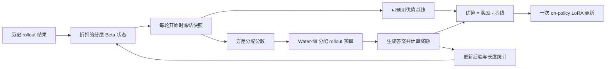

# Gemma 4 E2B/E4B 推理能力评测

<p align="center">
  <a href="./README.md"></a>
  <a href="./README.zh-CN.md"></a>
</p>

本仓库评测并改进两个小型 Gemma 4 模型（E2B 与 E4B）在高难度推理基准上的表现。所有调优都严格避开测试题，仓库包含：

1. 单题调用、自动评分并保存完整预测的评测框架；
2. 26 种提示策略和一个按任务选择提示的 CBRR 路由器，不修改模型权重；
3. 使用 LoRA 修改模型权重的新强化学习方法 **VOLT**。

英文 README 包含 26 种提示策略的逐项说明；本页提供项目中文概览，并完整解释 VOLT 方法。

## 数据集与冻结划分

| 基准 | 内容 | 样本数 |
|---|---|---:|
| **BBH** | 逻辑、日期、表格、对象追踪、单词排序等 27 个任务 | 6,511 |
| **BBEH** | 23 个比 BBH 更困难的后继任务 | 4,520 |
| **USR** | 谜题、简化谜题与基础推理 | 1,509 |

总计 12,540 个可自动评分的样本。每个任务内部按固定序号划分：

- `0–24`：校准集，可用于调优；
- `25–49`：验证集，只用于模型或检查点选择；
- `50+`：冻结测试集，共 9,550 题，调优阶段不可触碰。

## E2B 冻结测试集结果

| 方法 | 修改权重？ | 准确率 | 每题平均 token |
|---|---:|---:|---:|
| 直接回答 `direct_answer` | 否 | 26.39% | 15 |
| 最佳通用提示 `concise_cot_self_rank_k3` | 否 | 35.06% | 681 |
| CBRR 按任务提示路由 | 否 | **35.41%** | 66 |
| VOLT 强化学习微调 | 是，LoRA | 训练/评测进行中 | - |

详细统计、分数据集结果和全部策略矩阵见
[docs/DETAILED_RESULTS.md](docs/DETAILED_RESULTS.md)。

## CBRR：不修改权重的提示路由

不同任务适合不同提示。CBRR 使用每个任务的 25 个校准样本，基于配对胜负的 Beta-Bernoulli 后验判断某个提示是否可靠地优于 `direct_answer`。只有证据足够强时才切换，并把选定提示固定用于该任务之后的所有样本；它不会逐题偷看或选择。

CBRR 把 E2B 准确率从 26.39% 提升到 35.41%，同时每题仅使用约 66 个 token。完整的 26 种提示机制和逐项结果请查看[英文 README](README.md#the-26-prompt-strategies-explained)。

## VOLT：在 rollout 预算下进行方差最优强化学习

提示路由不会改变模型权重，因此存在上限。`rl/` 包通过 LoRA 微调 E2B，使用的新方法是 **VOLT**（**V**ariance-**O**ptimal a**L**location of **T**okens，token 方差最优分配）。它面向以下条件：训练数据少、奖励是可验证的二值正确性、只有一张共享 GPU，并且生成预算严格受限。

### 为什么固定 GRPO 分组会浪费 token

GRPO 为每个被选中的提示固定生成一组答案，并用当前组的奖励均值和标准差计算优势。二值奖励下，如果八个答案全部正确或全部错误，那么整组优势都等于零，生成的 token 无法更新策略。

这一问题在本套基准中非常突出：不少 BBH 题几乎总能答对，而不少 BBEH 题几乎总是答错。只有位于模型当前学习边界附近的提示，才经常产生有对有错的混合分组。

| 属性 | GRPO | VOLT |
|---|---|---|
| 每个提示的 rollout 数 | 固定为 8 | 自适应分配 1–8 个 |
| 优势基线 | 当前组均值 | 冻结的历史后验均值 |
| 单 rollout 更新 | 为零或无法定义 | 有效 |
| 全对/全错样本 | 优势为零 | 通常仍有非零优势 |
| 是否使用历史难度 | 否 | 是，并在任务层级部分池化 |
| 探索机制 | 随机轮换提示 | 15% 预算给最久未采样提示 |

### 一个后验状态驱动整个方法

对每个训练提示 `i`，VOLT 用折扣 Beta 证据跟踪当前成功概率
`p_i = P(回答正确 | prompt_i)`。具体提示会从同一任务的其他样本借用先验均值：

```text
task_mean_i = (task_wins + 1) / (task_wins + task_losses + 2)
alpha_i     = 折扣后的提示成功数 + m * task_mean_i
beta_i      = 折扣后的提示失败数 + m * (1 - task_mean_i)
```

当前配置的先验强度 `m = 4`。每轮把旧证据乘以 `gamma = 0.92`，使难度估计能够跟随正在变化的策略。

每轮生成开始前，VOLT 会冻结一次后验快照。快照提供两个当前启用的量：

```text
baseline_i = E[p_i] = alpha_i / (alpha_i + beta_i)

score_i    = sqrt(E[p_i(1-p_i)])
           = sqrt(alpha_i * beta_i /
                  ((alpha_i + beta_i) * (alpha_i + beta_i + 1)))
```

`baseline_i` 是预期正确率，`score_i` 则估计二值奖励变化最集中的位置。模型约有一半概率答对时分数最大；接近总对或总错时分数趋近于零。

### 方差最优 rollout 分配

设提示 `i` 获得 `n_i` 个 rollout，每个平均花费 `l_i` 个 token，其梯度估计方差为 `v_i`。在固定生成预算下最小化总估计方差，可得到平方根分配：

```text
n_i ∝ sqrt(v_i / l_i).
```

VOLT 明确假设策略 score 的方差随回答长度近似线性增长：

```text
v_i ≈ kappa * p_i(1-p_i) * l_i.
```

因此长度项抵消，得到：

```text
n_i ∝ sqrt(p_i(1-p_i)).
```

实现中使用后验期望代替未知的 `p_i`。每轮先保留 15% 预算给最久未采样的提示，其余预算按 `score_i` 比例分配；每个提示最多八个 rollout，并通过确定性的整数 water-filling 用完预算。这样既不会永久放弃旧提示，又把主要算力集中到学习边界。

### 可预测基线为何允许安全的自适应采样

令 `S_i(y) = grad log pi(y | prompt_i)` 为策略 score，`r` 为二值正确性奖励。只要基线在采样当前答案之前已经固定，就有：

```text
E[(r - baseline_i) * S_i(y) | 历史信息]
    = grad P(回答正确 | prompt_i).
```

因此 VOLT 使用最简单的优势：

```text
A = r - baseline_i.
```

关键在于“可预测”：基线和 rollout 数都只依赖以前轮次。给定历史后，它们就是常数，因此根据历史自适应选择提示不会给单提示策略梯度引入额外偏差。只生成一个答案也可以学习：

- `baseline = 0.2` 时，答对的优势是 `+0.8`，答错是 `-0.2`；
- `baseline = 0.8` 时，答对的优势是 `+0.2`，答错是 `-0.8`。

越出乎后验预期的结果，修正幅度越大。全对或全错样本不再因为组内归一化而机械地归零；但“优势非零”不代表每个样本的价值完全相同。



### 实际训练更新

每个完整回答得到一个序列级优势，该优势会广播到回答的所有生成 token。每轮执行一次严格 on-policy 的 REINFORCE 更新：

```text
loss = -sum_rollouts(advantage * sum_completion_tokens(log_probability))
       / (rollout 数 * 固定长度归一化常数)
```

当前实现不做当前组奖励标准差除法，不按每个回答的 token 数取平均，不重放 PPO 样本，也没有显式 KL 惩罚。它会裁剪梯度范数，并且只更新 rank-32 LoRA 适配器；基础模型文件保持不变。

E2B 实验使用 48 轮 × 每轮 448 个 rollout，采样温度 0.9，最多生成 384 个 token，每五轮在固定 300 题验证探针上进行贪心评测。训练池有 1,040 个可用校准提示，并额外完整留出 16 个任务用于测量未见任务迁移。

### 可选长度控制

VOLT 还实现了一个只惩罚长而正确答案的 primal-dual 长度约束。错误答案不会因为“尽早放弃”而得到奖励。乘子和 shaped baseline 都只读取冻结的历史长度统计，因此仍满足可预测性。

当前 E2B 配置关闭了这一组件，所以正在进行的实验只测试后验基线和自适应分配器，避免把长度 shaping 的影响混入主比较。

### 科学边界与当前状态

- 每个 rollout 对它所采样的提示都具有条件无偏梯度，但当前 loss 会让提示的权重与分配到的 rollout 数成正比。因此实现优化的是自适应课程，而不是所有提示的严格均匀平均；若要严格保持均匀目标，需要按提示归一化或使用重要性权重。
- “token 最优”依赖策略 score 方差随序列长度线性增长的假设。如果假设不成立，最优分配应保留显式长度成本项。
- 折扣后验只能近似跟踪策略变化；当同一任务内部提示差异很大时，任务层级池化也可能带来误导。
- 训练遥测已经显示预期机制：VOLT 在 GRPO 会丢弃大量同质组的地方仍能保留非零优势。但任何最终准确率结论都必须等待冻结测试集上的计算量匹配比较。

完整推导、证明、相关工作和论文草稿位于
[paper/volt/](paper/volt/)。

## 训练与评测

在 GPU 主机上运行：

```bash
# 计算量匹配的基线与 VOLT
python rl/run_train.py --config experiments/rl/grpo_e2b.json
python rl/run_train.py --config experiments/rl/volt_e2b.json

# 先在验证集选择检查点，再进行冻结测试评测
./scripts/run_rl_evals.sh
```

训练只使用校准集，验证集只负责选择检查点，冻结测试集只用于最终选定模型。

下载数据并进行 smoke test：

```bash
DATA_ROOT=/data/benwulab/gemma4-eval/datasets ./scripts/download_datasets.sh

python3 eval_benchmarks.py \
  --datasets-root /data/benwulab/gemma4-eval/datasets \
  --base-url http://127.0.0.1:8888/v1 \
  --model SubTokenLLM \
  --benchmarks bbh,bbeh \
  --limit-per-task 2 \
  --parallel 2 \
  --output-dir /data/benwulab/gemma4-eval/runs/smoke
```

## 仓库结构

```text
eval_benchmarks.py       评测框架与自动评分器
rl/                      VOLT/GRPO 训练、后验、分配与评测代码
scripts/                 策略矩阵、路由校准、RL 评测与分析脚本
experiments/             冻结协议、策略清单与 RL 配置
docs/                    协议、研究记录与详细结果表
paper/e2b-e4b-study/     提示策略研究论文与审计
paper/volt/              VOLT 方法、理论证明和论文草稿
results/                 已归档的预测、摘要与日志
ops/                     模型服务、路由、隧道与 systemd 配置
tests/                   评分器、协议、路由和 RL 数学单元测试
```
