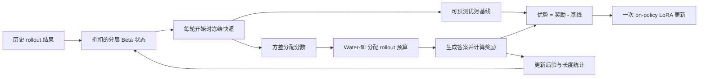

# Gemma 4 E2B/E4B 推理能力评测

<p align="center">
  <a href="./README.md"></a>
  <a href="./README.zh-CN.md"></a>
</p>

本仓库评测并改进两个小型 Gemma 4 模型（E2B 与 E4B）在高难度推理基准上的表现。所有调优都严格避开测试题，仓库包含：

1. 单题调用、自动评分并保存完整预测的评测框架；
2. 26 种提示策略和一个按任务选择提示的 CBRR 路由器，不修改模型权重；
3. 使用 LoRA 修改模型权重的新强化学习方法 **VOLT**。

英文 README 包含 26 种提示策略的逐项说明；本页提供项目中文概览，并完整解释 VOLT 方法。

## 数据集与冻结划分

| 基准 | 内容 | 样本数 |
|---|---|---:|
| **BBH** | 逻辑、日期、表格、对象追踪、单词排序等 27 个任务 | 6,511 |
| **BBEH** | 23 个比 BBH 更困难的后继任务 | 4,520 |
| **USR** | 谜题、简化谜题与基础推理 | 1,509 |

总计 12,540 个可自动评分的样本。每个任务内部按固定序号划分：

- `0–24`：校准集，可用于调优；
- `25–49`：验证集，只用于模型或检查点选择；
- `50+`：冻结测试集，共 9,550 题，调优阶段不可触碰。

## E2B 冻结测试集结果

| 方法 | 修改权重？ | 每题模型调用数 | 准确率 | 每题平均生成 token | 每题平均 API 时间 |
|---|---:|---:|---:|---:|---:|
| 直接回答 `direct_answer` | 否 | 1 | 26.39% | 14.7 | 0.585 秒 |
| 最佳通用提示 `concise_cot_self_rank_k3` | 否 | 4 | 35.06% | 681.3 | 11.228 秒 |
| CBRR 按任务提示路由 | 否 | 1 | **35.41%** | 65.6 | 1.287 秒 |
| VOLT 强化学习微调 | 是，LoRA | 1 | **待完成** | **待完成** | **待完成** |

详细统计、分数据集结果和全部策略矩阵见
[docs/DETAILED_RESULTS.md](docs/DETAILED_RESULTS.md)。

VOLT 与计算量匹配的 GRPO 基线均已完成训练和完整验证集评测，但二者的
冻结测试结果仍待完成，因此这里不提前报告测试准确率。

## 当前最佳方法：如何选择

不存在适合所有约束的单一冠军。在已经完成的冻结测试结果中，CBRR 的准确率
最高，也是已知任务 ID 时最好的效率/准确率折中；没有任务元数据时，自排序是
最强的通用纯提示方法；在已经训练的适配器中，VOLT 当前的完整验证集准确率最高，
但仍需等待冻结测试结果确认。

| 目标 | 推荐方法 | 原因 | 前提 |
|---|---|---|---|
| 最低成本和延迟 | `direct_answer`，也可测试 `canonical_short` | 一次很短的确定性调用 | 只需要模型 API |
| 最佳纯提示效率 | **CBRR** | 一次调用，冻结测试 35.41%，token 约为自排序的十分之一 | 稳定的任务 ID；每个任务 25 条带标签校准样本 |
| 最佳通用纯提示准确率 | **三样本自排序** | 不需要任务元数据或修改权重；冻结测试 35.06% | 四次调用和较大的 token 预算 |
| 当前最佳微调验证准确率 | **VOLT LoRA** | 完整验证集 36.04%，且比 GRPO 生成更少 token | 完全匹配的基础检查点、训练数据和 LoRA 部署能力 |
| 科学对照 | **GRPO** | 用于分离并测量 VOLT 方法贡献的计算量匹配 RL 基线 | 训练时为每题固定生成多条 rollout |

### 不要混合两条结果线

上面的纯提示表来自注册的 API 流程，覆盖全部 9,550 条冻结测试样本。时间列是
该次 API 实验的端到端每题耗时，因此如实包含自排序的三次生成调用和一次选择
调用。CBRR 在模型调用前离线完成路由，推理时仍然只调用模型一次。

权重微调这条实验线目前完成了 1,490 条完整验证样本的对比。三者使用与训练一致
的 `concise_cot` 提示，GRPO 和 VOLT 均使用固定验证探针选出的检查点：

| 完整验证集模型 | 正确数 | 准确率 | 平均生成 token | 本次评测墙钟时间 |
|---|---:|---:|---:|---:|
| 基础 E2B | 265 / 1,490 | 17.79% | 226.9 | 约 633 秒（0.425 秒/题） |
| 计算量匹配的 GRPO LoRA | 498 / 1,490 | 33.42% | 163.6 | 约 960 秒（0.644 秒/题） |
| **VOLT LoRA** | **537 / 1,490** | **36.04%** | **125.6** | **约 943 秒（0.633 秒/题）** |

这些验证集结果只建立了基础模型、GRPO 与 VOLT 三者之间的比较；它们**不能**证明
VOLT 已经超过 CBRR 或自排序，因为后两者的标题结果来自不同的数据划分和服务流程。

在这些逐题配对的验证预测上，VOLT 比 GRPO 多答对 39 题，即提升 2.62 个百分点；
VOLT 单独答对 121 题，GRPO 单独答对 82 题，McNemar `p = 0.0075`，按任务分层
bootstrap 的 95% 区间为 `+0.87` 到 `+4.36` 个百分点。VOLT 的生成 token 比
GRPO 少 23.2%。与基础模型相比，VOLT 提升 18.26 个百分点，生成 token 少 44.6%。

这里的墙钟时间来自本地批量评测和未合并的 PEFT LoRA，与上表 API 延迟不是同一
计时协议。本次运行中 VOLT 略快于 GRPO；但尽管回答更短，两种未合并适配器的墙钟
吞吐仍比裸基础模型慢约 49–52%。生产部署前应先把 LoRA 合并进基础权重，再在目标
服务栈上重新测量延迟。

训练效率更直接地显示了 VOLT 的机制优势。两个实验都生成了 21,504 条 rollout。
GRPO 只有 5,432 条 rollout 具有非零组相对优势；VOLT 的 21,504 条全部保留了
非零信号，相当于约 4 倍的有效 rollout。VOLT 共生成 4,655,325 个 token，GRPO
为 5,593,771 个，减少 16.8%。观察到的有效训练时间约为 VOLT 4 小时 38 分、
GRPO 4 小时 49 分；由于共享 GPU 上发生过 OOM 与恢复，这两个墙钟数只作描述，
不能视为严格受控的速度基准。

### 输入/输出示例

下面使用一道人工构造的小型逻辑题展示准确的请求与响应形态。它不是从结果中挑选
的有利样本，也没有参与任何准确率计算。为与代码中的真实模板一致，发给模型的
提示保留英文原文。

> Every red object is square. Object K is red. Is object K square?

#### 1. 直接回答：成本最低的单调用基线

发送给模型的输入：

```text
Every red object is square. Object K is red. Is object K square?

Return only the final answer. Do not include reasoning, explanation, or extra text.
```

期望的响应形态：

```text
Yes
```

当任务混合了布尔值、选项标签、数字和列表时，`canonical_short` 是更稳妥的变体：
它明确规定每种答案的规范输出格式。两者都只调用一次，也不需要校准。

#### 2. 自排序：先生成三条，再让模型选择

前三次生成调用都使用 `concise_cot` 形式：

```text
Every red object is square. Object K is red. Is object K square?

Think briefly and solve the problem. Keep the reasoning concise.
End with exactly one line in this format: The final answer is: <answer>
```

示例候选输出：

```text
Candidate 1: K is red and every red object is square.
The final answer is: Yes

Candidate 2: The rule does not name K directly.
The final answer is: No

Candidate 3: Applying red -> square to K gives square(K).
The final answer is: Yes
```

第四次确定性调用接收原题和三条未经改写的候选：

```text
Question:
Every red object is square. Object K is red. Is object K square?

Candidate 1:
K is red and every red object is square.
The final answer is: Yes

Candidate 2:
The rule does not name K directly.
The final answer is: No

Candidate 3:
Applying red -> square to K gives square(K).
The final answer is: Yes

Compare the candidates against the exact question and every decisive constraint.
Do not vote by wording or length. Select or correct the answer that is best supported.
Return only the final answer, with no explanation.
```

选择器输出：

```text
Yes
```

这不是多数投票：即使三个候选都错，选择器也允许修正答案。最后一次验证兼格式修复
解释了准确率增益，四次调用和冻结测试中平均 681 个 token 则解释了其延迟成本。

#### 3. CBRR：校准一次，按任务路由，只调用一次

CBRR 在校准阶段的输入是每个候选策略在 25 条带标签样本上的
`（任务 ID，策略，二值正确性）`，输出是一份冻结 JSON 策略。下面是仓库中 E2B
策略的真实节选：

```json
{
  "default_strategy": "direct_answer",
  "task_strategies": {
    "bbh/boolean_expressions": "concise_cot",
    "bbh/causal_judgement": "canonical_short"
  }
}
```

推理时，应用提供任务键和问题。对于下面这条人工构造的
`bbh/boolean_expressions` 请求，路由器查到 `concise_cot`，然后构造一次普通模型
调用：

```text
Is the Boolean expression `True and not False` true?

Think briefly and solve the problem. Keep the reasoning concise.
End with exactly one line in this format: The final answer is: <answer>
```

示例模型输出：

```text
not False is True, so the conjunction is True.
The final answer is: True
```

任务 ID 只用于选择并构造提示，不会被暗中插入模型输入。CBRR 不逐题搜索，不根据
已经生成的答案路由，也不增加模型调用；未知任务回退到 `direct_answer`。

#### 4. GRPO：计算量匹配的强化学习基线

**GRPO** 全称 **Group Relative Policy Optimization（组相对策略优化）**。对每个
训练提示，它固定采样一组回答，用二值精确匹配奖励给每条回答打分，再相对于当前
组归一化奖励，因此无需另外训练价值模型。

例如四条 rollout 的奖励为 `[1, 1, 0, 0]` 时，均值为 `0.5`、标准差为 `0.5`，
归一化优势是 `[+1, +1, -1, -1]`，这些值用于训练 LoRA。但奖励若为
`[1, 1, 1, 1]` 或 `[0, 0, 0, 0]`，每条回答的优势都为零：模型已经花费生成
token，这一组却不给出策略梯度方向。实际基线每组固定为八条 rollout，并与 VOLT
使用相同的总 rollout 预算。

部署时不再需要 GRPO 训练逻辑。输入只是选定的提示模板，输出是加载 LoRA 后模型
生成的一条普通回答。

#### 5. VOLT：历史基线与自适应 rollout 分配

VOLT 接收与 GRPO 相同的训练样本和二值奖励，但先前轮次积累的状态会决定两类训练
输出：

1. 在采样本轮回答之前，冻结后验输出 `baseline_i` 和分配分数；
2. 确定性分配器为每个选中提示输出 1–8 条 rollout；
3. 评分器为每条完成输出奖励 `r`；
4. 训练器输出优势 `r - baseline_i`，并且只更新 LoRA。

假设历史结果给某个提示的冻结基线是 `0.2`，分配器只购买一条 rollout：

```text
训练输入      -> 问题 + concise_cot 指令
模型输出      -> "The final answer is: Yes"
验证器输出    -> reward = 1
VOLT 输出     -> advantage = 1 - 0.2 = +0.8
优化器        -> 在 LoRA 权重中强化这条采样完成
```

如果答错，优势就是 `-0.2`。与 GRPO 不同，单个结果仍然可用于学习，因为基线来自
本轮之前已冻结的历史，而不是从当前组估计。后验正确率接近 `0.5` 的题获得更多
rollout；几乎总对或总错的题获得更少，同时保留 15% 探索预算防止任何题永久饿死。

部署这个适配器时，流程非常普通：

```text
应用输入       -> 一条 user 提示
基础模型+VOLT LoRA -> 一条生成回答
应用输出       -> 解析后的最终答案
```

推理阶段没有后验跟踪器、分配器、奖励函数或多样本投票。VOLT 改变的是 LoRA 的
训练方式，而不是服务 API。

### 运行这些方法

在下文[训练与评测](#训练与评测)中的通用评测命令上，选择一组方法参数：

```bash
# 最便宜的基线：一次确定性调用
--prompt-strategy direct_answer --temperature 0

# 通用自排序：3 条候选 + 1 次选择
--prompt-strategy concise_cot --self-consistency-k 3 \
  --response-selection self_rank --temperature 0.7 \
  --max-tokens 256 --selection-max-tokens 64

# CBRR：一次路由后的调用；缺失任务使用策略文件中的默认值
--prompt-policy results/e2b-confirmatory-20260709_231405/selection/cbrr_policy.json \
  --temperature 0
```

GRPO、VOLT 的训练以及检查点选择/最终评测命令见下文 VOLT 章节。

### LoRA 能否用于这些数据集之外的应用？

从技术上可以。VOLT 产物是标准 PEFT LoRA 适配器，不是只会查询基准答案的表。
只要加载到训练时使用的**完全兼容 E2B 基础检查点和 tokenizer** 上，它就能接收
任意应用提示，并且可以随时启用、关闭或合并进基础权重。但它不能直接挂载到另一种
模型架构或不相关的基础版本。

目前的迁移证据积极但有限。在 16 个整体排除于 RL 训练的任务上（400 条验证样本），
基础 E2B、GRPO、VOLT 分别得到 22.00%、30.75%、33.25%。VOLT 比 GRPO 高 2.50
个百分点，但该子集上没有统计显著性（`p = 0.237`；bootstrap 区间 `-0.75` 到
`+6.00`）。因此，现有结果还不能证明它会普遍改善聊天、代码或特定行业应用。
部署前应在目标应用的真实提示、安全约束、输出格式和延迟条件下重新评测。

纯提示方法也可以与 LoRA 组合，但在基础模型上校准的路由器可能在微调后失效。
应针对新检查点重新运行 CBRR 校准，而不是假设原有任务策略仍然最优。生产环境中
可按标准 PEFT 方式加载或合并：

```python
from peft import PeftModel
from transformers import AutoModelForCausalLM, AutoTokenizer

base_id = "<训练所用的完全相同 E2B 基础检查点>"
adapter_dir = "<选定检查点>/adapter"

tokenizer = AutoTokenizer.from_pretrained(base_id)
base = AutoModelForCausalLM.from_pretrained(base_id, device_map="auto")
model = PeftModel.from_pretrained(base, adapter_dir)
model = model.merge_and_unload()  # 可选；合并前后都应实测
```

## CBRR：不修改权重的提示路由

不同任务适合不同提示。CBRR 使用每个任务的 25 个校准样本，基于配对胜负的 Beta-Bernoulli 后验判断某个提示是否可靠地优于 `direct_answer`。只有证据足够强时才切换，并把选定提示固定用于该任务之后的所有样本；它不会逐题偷看或选择。

CBRR 把 E2B 准确率从 26.39% 提升到 35.41%，同时每题仅使用约 66 个 token。完整的 26 种提示机制和逐项结果请查看[英文 README](README.md#the-26-prompt-strategies-explained)。

## VOLT：在 rollout 预算下进行方差最优强化学习

提示路由不会改变模型权重，因此存在上限。`rl/` 包通过 LoRA 微调 E2B，使用的新方法是 **VOLT**（**V**ariance-**O**ptimal a**L**location of **T**okens，token 方差最优分配）。它面向以下条件：训练数据少、奖励是可验证的二值正确性、只有一张共享 GPU，并且生成预算严格受限。

### 为什么固定 GRPO 分组会浪费 token

GRPO 为每个被选中的提示固定生成一组答案，并用当前组的奖励均值和标准差计算优势。二值奖励下，如果八个答案全部正确或全部错误，那么整组优势都等于零，生成的 token 无法更新策略。

这一问题在本套基准中非常突出：不少 BBH 题几乎总能答对，而不少 BBEH 题几乎总是答错。只有位于模型当前学习边界附近的提示，才经常产生有对有错的混合分组。

| 属性 | GRPO | VOLT |
|---|---|---|
| 每个提示的 rollout 数 | 固定为 8 | 自适应分配 1–8 个 |
| 优势基线 | 当前组均值 | 冻结的历史后验均值 |
| 单 rollout 更新 | 为零或无法定义 | 有效 |
| 全对/全错样本 | 优势为零 | 通常仍有非零优势 |
| 是否使用历史难度 | 否 | 是，并在任务层级部分池化 |
| 探索机制 | 随机轮换提示 | 15% 预算给最久未采样提示 |

### 一个后验状态驱动整个方法

对每个训练提示 `i`，VOLT 用折扣 Beta 证据跟踪当前成功概率
`p_i = P(回答正确 | prompt_i)`。具体提示会从同一任务的其他样本借用先验均值：

```text
task_mean_i = (task_wins + 1) / (task_wins + task_losses + 2)
alpha_i     = 折扣后的提示成功数 + m * task_mean_i
beta_i      = 折扣后的提示失败数 + m * (1 - task_mean_i)
```

当前配置的先验强度 `m = 4`。每轮把旧证据乘以 `gamma = 0.92`，使难度估计能够跟随正在变化的策略。

每轮生成开始前，VOLT 会冻结一次后验快照。快照提供两个当前启用的量：

```text
baseline_i = E[p_i] = alpha_i / (alpha_i + beta_i)

score_i    = sqrt(E[p_i(1-p_i)])
           = sqrt(alpha_i * beta_i /
                  ((alpha_i + beta_i) * (alpha_i + beta_i + 1)))
```

`baseline_i` 是预期正确率，`score_i` 则估计二值奖励变化最集中的位置。模型约有一半概率答对时分数最大；接近总对或总错时分数趋近于零。

### 方差最优 rollout 分配

设提示 `i` 获得 `n_i` 个 rollout，每个平均花费 `l_i` 个 token，其梯度估计方差为 `v_i`。在固定生成预算下最小化总估计方差，可得到平方根分配：

```text
n_i ∝ sqrt(v_i / l_i).
```

VOLT 明确假设策略 score 的方差随回答长度近似线性增长：

```text
v_i ≈ kappa * p_i(1-p_i) * l_i.
```

因此长度项抵消，得到：

```text
n_i ∝ sqrt(p_i(1-p_i)).
```

实现中使用后验期望代替未知的 `p_i`。每轮先保留 15% 预算给最久未采样的提示，其余预算按 `score_i` 比例分配；每个提示最多八个 rollout，并通过确定性的整数 water-filling 用完预算。这样既不会永久放弃旧提示，又把主要算力集中到学习边界。

### 可预测基线为何允许安全的自适应采样

令 `S_i(y) = grad log pi(y | prompt_i)` 为策略 score，`r` 为二值正确性奖励。只要基线在采样当前答案之前已经固定，就有：

```text
E[(r - baseline_i) * S_i(y) | 历史信息]
    = grad P(回答正确 | prompt_i).
```

因此 VOLT 使用最简单的优势：

```text
A = r - baseline_i.
```

关键在于“可预测”：基线和 rollout 数都只依赖以前轮次。给定历史后，它们就是常数，因此根据历史自适应选择提示不会给单提示策略梯度引入额外偏差。只生成一个答案也可以学习：

- `baseline = 0.2` 时，答对的优势是 `+0.8`，答错是 `-0.2`；
- `baseline = 0.8` 时，答对的优势是 `+0.2`，答错是 `-0.8`。

越出乎后验预期的结果，修正幅度越大。全对或全错样本不再因为组内归一化而机械地归零；但“优势非零”不代表每个样本的价值完全相同。



### 实际训练更新

每个完整回答得到一个序列级优势，该优势会广播到回答的所有生成 token。每轮执行一次严格 on-policy 的 REINFORCE 更新：

```text
loss = -sum_rollouts(advantage * sum_completion_tokens(log_probability))
       / (rollout 数 * 固定长度归一化常数)
```

当前实现不做当前组奖励标准差除法，不按每个回答的 token 数取平均，不重放 PPO 样本，也没有显式 KL 惩罚。它会裁剪梯度范数，并且只更新 rank-32 LoRA 适配器；基础模型文件保持不变。

E2B 实验使用 48 轮 × 每轮 448 个 rollout，采样温度 0.9，最多生成 384 个 token，每五轮在固定 300 题验证探针上进行贪心评测。训练池有 1,040 个可用校准提示，并额外完整留出 16 个任务用于测量未见任务迁移。

### 可选长度控制

VOLT 还实现了一个只惩罚长而正确答案的 primal-dual 长度约束。错误答案不会因为“尽早放弃”而得到奖励。乘子和 shaped baseline 都只读取冻结的历史长度统计，因此仍满足可预测性。

当前 E2B 配置关闭了这一组件，所以正在进行的实验只测试后验基线和自适应分配器，避免把长度 shaping 的影响混入主比较。

### 科学边界与当前状态

- 每个 rollout 对它所采样的提示都具有条件无偏梯度，但当前 loss 会让提示的权重与分配到的 rollout 数成正比。因此实现优化的是自适应课程，而不是所有提示的严格均匀平均；若要严格保持均匀目标，需要按提示归一化或使用重要性权重。
- “token 最优”依赖策略 score 方差随序列长度线性增长的假设。如果假设不成立，最优分配应保留显式长度成本项。
- 折扣后验只能近似跟踪策略变化；当同一任务内部提示差异很大时，任务层级池化也可能带来误导。
- 训练遥测已经显示预期机制：VOLT 在 GRPO 会丢弃大量同质组的地方仍能保留非零优势。但任何最终准确率结论都必须等待冻结测试集上的计算量匹配比较。

完整推导、证明、相关工作和论文草稿位于
[paper/volt/](paper/volt/)。

## 训练与评测

在 GPU 主机上运行：

```bash
# 计算量匹配的基线与 VOLT
python rl/run_train.py --config experiments/rl/grpo_e2b.json
python rl/run_train.py --config experiments/rl/volt_e2b.json

# 先在验证集选择检查点，再进行冻结测试评测
./scripts/run_rl_evals.sh
```

训练只使用校准集，验证集只负责选择检查点，冻结测试集只用于最终选定模型。

下载数据并进行 smoke test：

```bash
DATA_ROOT=/data/benwulab/gemma4-eval/datasets ./scripts/download_datasets.sh

python3 eval_benchmarks.py \
  --datasets-root /data/benwulab/gemma4-eval/datasets \
  --base-url http://127.0.0.1:8888/v1 \
  --model SubTokenLLM \
  --benchmarks bbh,bbeh \
  --limit-per-task 2 \
  --parallel 2 \
  --output-dir /data/benwulab/gemma4-eval/runs/smoke
```

## 仓库结构

```text
eval_benchmarks.py       评测框架与自动评分器
rl/                      VOLT/GRPO 训练、后验、分配与评测代码
scripts/                 策略矩阵、路由校准、RL 评测与分析脚本
experiments/             冻结协议、策略清单与 RL 配置
docs/                    协议、研究记录与详细结果表
paper/e2b-e4b-study/     提示策略研究论文与审计
paper/volt/              VOLT 方法、理论证明和论文草稿
results/                 已归档的预测、摘要与日志
ops/                     模型服务、路由、隧道与 systemd 配置
tests/                   评分器、协议、路由和 RL 数学单元测试
```
